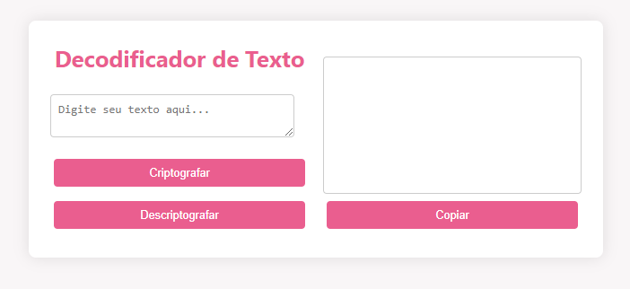
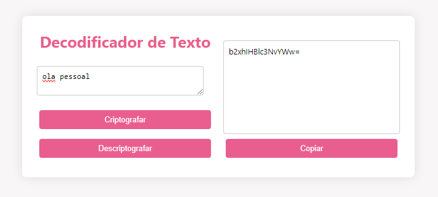
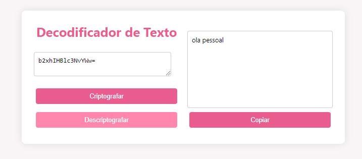
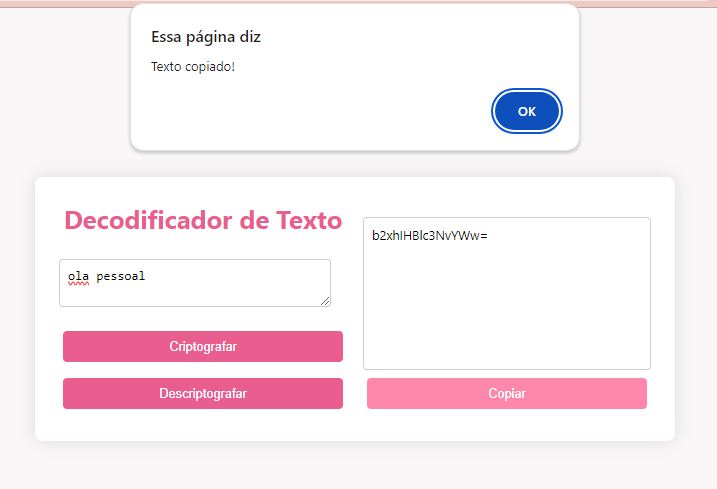

# Decodificador
Challenge Decodificador de Texto

Um simples decodificador de texto utilizando HTML, CSS e JavaScript, com um design estético em tons de rosa pastel.

  

<h3 align="left">Funcionalidades</h3>

Criptografar: Transforma o texto inserido usando um algoritmo simples de criptografia.

  

Descriptografar: Converte o texto criptografado de volta ao texto original.

  

Copiar Texto: Permite copiar o texto resultante para a área de transferência.

 

<h3 align="left">Como Usar</h3>

Clone o Repositório

Abra o Arquivo HTML: Abra o arquivo index.html em seu navegador web.

Digite um Texto: Insira o texto que deseja criptografar ou descriptografar no campo de texto.

Criptografar ou Descriptografar:
Clique no botão "Criptografar" para codificar o texto.
Clique no botão "Descriptografar" para decodificar o texto.

Copiar o Texto Resultante: Após a operação de criptografia ou descriptografia, você pode clicar no botão "Copiar" para copiar o texto resultante para a área de transferência.

<h3 align="left">Tecnologias Utilizadas</h3>

